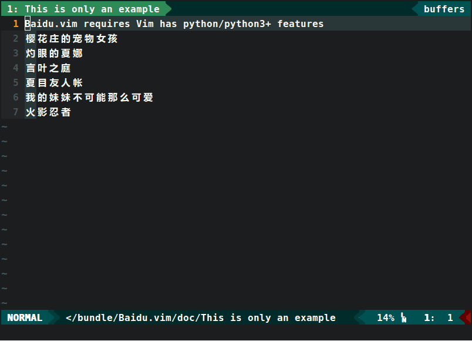

# Baidu.vim


### 简单实现Vim划词搜索功能
* 支持快速搜索光标下词条以及可视模式下的选词搜索
* 支持 Baidu 及 BaiduAll 命令进行搜索
* 可识别连词
* 要求 Vim 版本支持Python2/3+特性
* 依赖 bs4 Python库
* 使用时需要联网
* 仅限百度百科已有的词条



### 安装
- 通过Vundle.vim
```VIML
    Plugin 'm8524769/baidu.vim'
    :PluginInstall
```
- 通过vim-plug
```VIML
    Plug 'm8524769/baidu.vim'
    :PlugInstall
```
- 安装 bs4 Python库
```shell
	pip install bs4
```
- Arch 用户可通过 pacman 安装bs4
```shell
	pacman -S python-beautifulsoup4
```

### 默认快捷键映射
```VIML
    " 命令行显示搜索结果
    nmap <silent> <Leader>b <Plug>BaiduSearch
    vmap <silent> <Leader>b <Plug>BaiduVSearch
    " 新窗口显示搜索结果
    nmap <silent> <Leader>w <Plug>Win_BaiduSearch
    vmap <silent> <Leader>w <Plug>Win_BaiduVSearch
    " `q` 或 `Enter` 退出BaiduSearch窗口
    " `m` 显示其他义项
```
- 你也可以按自己的喜好自定义快捷键

### 默认Python版本
```VIML
    let g:py_version = 3
```

### 默认缓存路径
```VIML
    let g:baidu_cache_path = '$VIM/vimfiles/bundle/Baidu.vim/cache'
```

#### Update_1 Date: 2016/12/30 周五 13:35
- 优化异常处理
- 更改`:BaiduW`命令为`:BaiduAll`
- 可在 Airline  Statusline 中显示关键词
- 新增`m`可显示其他义项

#### Update_2 Date: 2017/1/2 周一 8:54
- 优化显示其他义项的性能
- 新增缓存机制
  * 保存历史命令行搜索结果以提高性能
  * 断网仍可查看历史搜索结果
- 用户可自定义缓存路径
  * 只能在Vim根目录下

#### Update_3 Date: 2017/1/28 周六 0:36
- 可识别以下划线，逗号，分号或空格分隔的多个英文单词
    * 例如 'A_B, C; D E' 的关键词会默认以窗口模式输出各个结果
    * 'A', 'B', 'C'均可写入缓存以便下次读取

#### Update_4 Date: 2017/3/1 周三 21:58
- 新增多词窗口内关键词高亮
- 解决与其他插件的冲突问题

#### Update_5 Date: 2017/6/4 周日 23:53
- Python 版本改为用户自定义，默认 Python3
- 已通过 Win10 下的测试，暂时未发现 Bug
- 去除 lxml 库的依赖，改为自带的 html.parser 来解析网页
- 修复大部分 Python2 与 Python3+ 的兼容问题

# *Happy Viming !!*

#### 参考项目
- https://github.com/iamcco/dict.vim
